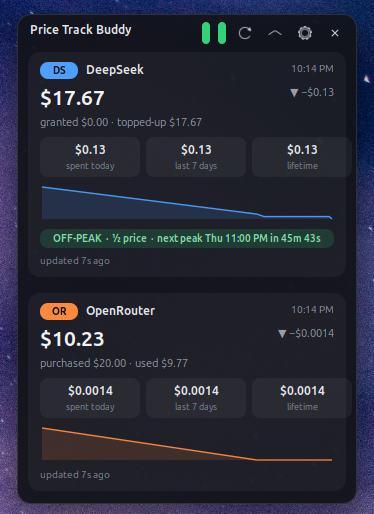
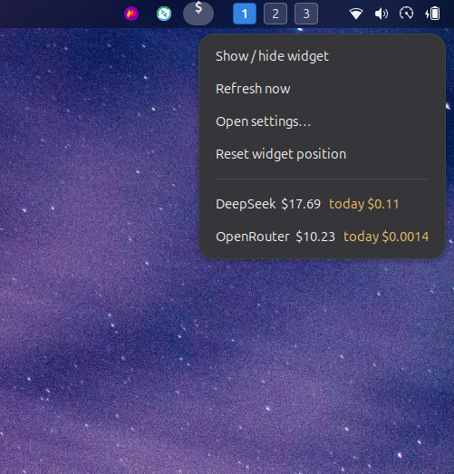

# Price Track Buddy

> 🚧 **UNDER DEVELOPMENT** — This extension is a work in progress. Its features may change and it may have unforeseen bugs. Use at your own risk; report issues as you find them.

A floating GNOME Shell panel that keeps live price/balance updates for your
**DeepSeek** and **OpenRouter** API accounts and remembers how much you spend
over time.

Built by **Moss AI Studio** · uuid `price-track-buddy@mossaistudio.com`



 — tested on
GNOME 50 / gjs 1.88 (Ubuntu 24.x, Wayland).

---

## What it does

- A draggable, collapsible glass panel floats over your desktop (default:
  bottom-right). Collapsing it (the chevron) keeps it on screen in a minimal
  mode: one compact row per provider with its `DS`/`OR` tag, current balance
  and today's spend. Expanded, it shows a card per provider:

  | DeepSeek card | OpenRouter card |
  |---|---|
  | Current total balance (`granted` + `topped-up` shown separately) | Credits remaining |
  | Balance delta since the last reading (▲ spent / ▼ topped up) | Purchased vs. used credits |
  | Spent today / last 7 days / lifetime (derived from balance deltas) | Same spend columns |
  | 30-minute mini sparkline of the balance | Sparkline of credits |
  | **Peak / off-peak billing banner** (Beijing-hours windows, live countdown) | — |

- A small `$` indicator in the top panel (toggleable) with a menu:
  show/hide the widget, refresh now, open settings, reset widget position, and
  live per-provider one-line balances.
- Readings are persisted to a local ledger, so history and "spent today"
  survive restarts. History is capped (480 points per provider, older points
  are averaged down).

The top-panel indicator carries the same live numbers:




## Requirements

- GNOME Shell 45–50 (gjs ≥ 1.74; built against gjs 1.88)
- Network access to `api.deepseek.com` and/or `openrouter.ai`

## Install

```bash
cd price-track-buddy@mossaistudio.com
./install.sh          # → ~/.local/share/gnome-shell/extensions/
```

Then activate it:

- **Extensions app** (`gnome-extensions-app`, preinstalled on Ubuntu) → enable
  **Price Track Buddy**, or
- `gnome-extensions enable price-track-buddy@mossaistudio.com`

On Wayland, Shell extension enable/disable applies after you log out and back
in (or `Alt+F2` → `r` on X11).

## Update

Pull the latest source and re-run the installer. `install.sh` is also the
update step: it copies the current `extension.js`, `prefs.js`,
`stylesheet.css`, `lib/*.js` and the schema into
`~/.local/share/gnome-shell/extensions/`, and recompiles
`gschemas.compiled` (needed whenever a release adds or changes a setting).

```bash
cd price-track-buddy@mossaistudio.com
git pull
./install.sh
```

Then load the new code the same way as a fresh install:

- **Wayland** — log out and back in.
- **X11** — `Alt+F2` → `r`.

Your settings and history are kept: settings live in dconf
(`/org/gnome/shell/extensions/price-track-buddy/`) and the spend ledger in
`~/.local/share/price-track-buddy/`, neither of which `install.sh` touches.

## Configuration

Open **Extensions** → **Price Track Buddy** ⚙ (or use the widget's gear icon /
indicator menu). Two pages:

**Providers**

| Setting | Notes |
|---|---|
| Track DeepSeek | Enable/disable polling DeepSeek |
| DeepSeek API key | `sk-…` key with balance permission |
| DeepSeek base URL | Optional; default `https://api.deepseek.com` |
| Preferred currency | Optional; pick one of the currencies the API reports (empty = first entry) |
| Track OpenRouter | Enable/disable polling OpenRouter |
| OpenRouter API key | **Management** key (`sk-or-v1-…`) — a publishable key will get HTTP 401 |
| OpenRouter base URL | Optional; default `https://openrouter.ai/api/v1` |

> [!WARNING]
> Keys are stored via GSettings/dconf, which is **plaintext** on disk. Use a
> dedicated key, or a restricted/proxy endpoint as Base URL, if that bothers
> you.

**General**

| Setting | Notes |
|---|---|
| Refresh interval | 20–3600 s (default 60 s) |
| Show floating widget | Hides the panel (indicator still works) |
| Always on top | Keep the widget visible over fullscreen windows (off = a fullscreen window on its monitor covers it) |
| Widget opacity | 20–100 % panel opacity |
| Show top panel indicator | Hides the `$` indicator |
| Widget position | Reset to the bottom-right corner (drag to move) |

## Where the data lives

- **Settings**: `dconf` key
  `/org/gnome/shell/extensions/price-track-buddy/` (query with
  `gsettings list-recursively org.gnome.shell.extensions.price-track-buddy`)
- **Ledger history**: `~/.local/share/price-track-buddy/deepseek.json` and
  `openrouter.json`. Delete a file to reset that provider's history.

## Reading the numbers — important caveats

- **Spend is derived from balance deltas**, not from invoices. Totals cover
  only the time since tracking began (the first reading seeds `trackedSince`).
- DeepSeek **granted-balance expiry** lowers the reported balance without any
  API call being made, and therefore looks like spend for that day. The card
  always shows `granted` and `topped-up` separately; if one day looks huge,
  compare those two before blaming usage.
- If DeepSeek reports a **different currency** than before, history resets so
  totals stay comparable, and the ledger re-seeds.
- Peak pricing: DeepSeek bills **1× price Mon–Fri 09–12 & 14–18 Beijing time**,
  **0.5× otherwise** (UTC windows 01–04 and 06–10 on weekdays; weekends all
  off-peak). The banner shows the current multiplier and a live countdown.

## Troubleshooting

| Symptom | Fix |
|---|---|
| `API key rejected (401)` | Wrong key/prefixed URL. OpenRouter needs a *management* key. |
| `Not configured` / `No API key set` | Add the key in Settings; polling is skipped until then. |
| `Network error` | Machine offline; will retry on the next interval. |
| Panel doesn't appear after `gnome-extensions enable` | Relog / restart the Shell; check `journalctl -f /usr/bin/gnome-shell` for JS errors. |
| GSettings key missing in prefs | Re-run `./install.sh` (it compiles `schemas/gschemas.compiled`). |

## Project layout

```
extension.js        shell entry point: settings → providers → ledgers → widget + indicator + polling
prefs.js            libadwaita preferences window (where keys are plugged in)
lib/providers.js    DeepSeek /user/balance + OpenRouter /credits clients (libsoup3)
lib/ledger.js       JSON ledger with daily buckets + capped point history
lib/peak.js         DeepSeek peak/off-peak window math (ported from DeepSeek Harness)
lib/widget.js       floating glass panel UI (drag, collapse, sparklines)
lib/format.js       money/duration/ago/error formatting
lib/http.js         libsoup3 GET wrapper (no Web fetch in gjs)
schemas/            GSettings schema (compiled to gschemas.compiled at install)
test/run-tests.mjs  gjs unit + integration tests:  gjs -m test/run-tests.mjs
```

## Development

```bash
node --check extension.js prefs.js lib/*.js   # syntax
gjs -m test/run-tests.mjs                     # 50 unit/integration tests
```

## Credits

Inspired by the `balance-buddy` plugin of
[DeepSeek Harness](https://github.com/deepseek-ai/DeepSeek-Harness)
(peak-window logic and ledger design). MIT-licensed.